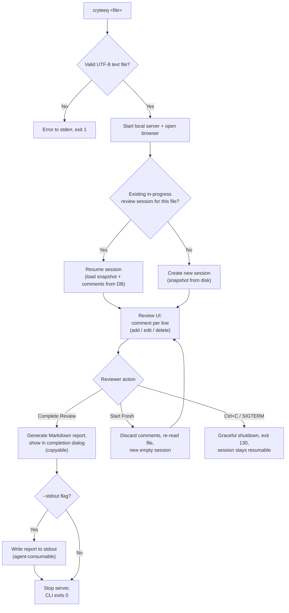

# Implementation Spec — v0.0 Base MVP

| | |
|---|---|
| Spec | `v-0.0-base` (frozen once implemented) |
| Date | 2026-09-30 |
| Status | In progress |
| Provenance | Absorbs the approved SRS v2.0 (2026-09-30); this spec is the normative baseline for requirements and implementation |

---

## 1. User Story & Expected Behavior

**As a human reviewer**, when I run `cryteeq <file>`, my browser opens a pull-request-style view of the file: I hover a line, click `+`, and write a comment; comments save instantly and survive restarts; I can edit or delete them; I can **Start Fresh** to discard everything and begin again; and when I click **Complete Review**, a dialog shows the generated Markdown report with a **Copy** button, the server stops, and the CLI exits `0`.

**As an AI agent**, when I run `cryteeq <file> --stdout`, the command blocks while the human reviews; on completion I receive the Markdown report on stdout (and nothing else), parse it per `SKILL.md`, and apply the feedback to the file. Exit `0` + report on stdout = completed review.

**Core loop:**



The contracts in §2–§6 are **normative**. FR IDs are stable and are used for traceability in the task breakdown, in later `specs/v-0.x-*.md` files, and in `AGENTS.md`. Repo conventions (logging, error handling, testing, git) live in `AGENTS.md`.

## 2. Functional Requirements

### 2.1 CLI (FR-1)

| ID | Requirement |
|----|-------------|
| FR-1.1 | `cryteeq <file>` starts the server and opens the review UI in the default browser |
| FR-1.2 | Flags: `--port <n>` (default: auto-pick free port starting at 4173), `--no-open` (do not launch browser), `--stdout` (emit the Markdown report on standard output upon completion), `--help`, `--version`. `--help`/`--version` are **usage paths**: they print to stdout, exit `0`, never start a server, and are never logged |
| FR-1.3 | Invalid input (missing file, binary/non-UTF-8 file, unreadable) produces a clear error on stderr; no server starts |
| FR-1.4 | `Ctrl+C` (SIGINT/SIGTERM) shuts down gracefully; comments already saved; **no** report generated; session remains resumable. Once report delivery/emission begins, signals are deferred — completion wins (exit `0`) |
| FR-1.5 | With `--stdout`: stdout carries **only** the Markdown report — all progress, summary, and error output goes to stderr. `--stdout` does not imply `--no-open` (the browser still opens for the human reviewer) |
| FR-1.6 | Runtime errors — file validation failure (FR-1.3), explicit `--port` in use, no free port after 100 attempts, server listen failure, DB open failure, report generation failure (FR-5.3), and uncaught process errors (`uncaughtException` / `unhandledRejection`) — are appended to a per-launch log file in `~/.cryteeq/logs/`, named `YYYY-MM-DDTHH-MM-SS-mmmZ-<pid>.log` (e.g. `2026-09-30T18-22-41-123Z-4567.log`). The directory and file are created **lazily on first write** — clean runs create no files. Usage errors (argument/flag parse failures, invalid `--port` value, `--help`, `--version`) are **not** logged. Log write failures are swallowed and never affect the run. Log entries carry metadata only — never file content, comment text, or report content. `CRYTEEQ_LOG_DIR` overrides the directory (tests). Entry format: `<ISO timestamp> ERROR <message>` |

**Exit codes (consolidated contract):**

| Code | Meaning | stdout |
|---|---|---|
| `0` | Review completed; report delivered — or a usage path (`--help`/`--version`) finished | Markdown report (when `--stdout`); usage text for `--help`/`--version` |
| `1` | Usage or runtime error — argument/flag errors, invalid file (FR-1.3), invalid `--port` value, explicit `--port` in use, no free port after 100 attempts, server listen failure, DB open failure | empty |
| `130` | Interrupted (SIGINT/SIGTERM) — comments saved, session resumable, no report generated | empty |

Note: a report-generation failure (FR-5.3) is **transient** — the server stays up and the reviewer retries; it never terminates the process, so it has no exit code.

### 2.2 Server & API (FR-2)

| ID | Requirement |
|----|-------------|
| FR-2.1 | Serve the built React SPA at `/` and the API under `/api/*`; bind localhost only |
| FR-2.2 | `GET /api/review` — metadata: file name, absolute path, size, line count, content hash (SHA-256), language, review status, and `hash_changed` (true when the file's current on-disk content hash differs from the session's stored hash). The on-disk hash is recomputed best-effort on each call; a missing/unreadable file yields `hash_changed: true` and the route still returns `200` — it never fails on the recompute |
| FR-2.3 | `GET /api/file` — the session's file content (raw, line-preserving), as snapshotted when the session started. The snapshot is CRLF-normalized to LF at load time; the stored SHA-256 is computed over the LF-normalized UTF-8 content |
| FR-2.4 | `GET /api/comments` — all comments for the current session |
| FR-2.5 | `POST /api/comments` — `{line, text}`; non-empty text after trim; line must exist in the file (`1..line_count`); text capped at 64 KiB |
| FR-2.6 | `PATCH /api/comments/:id` — edit text (same validation as FR-2.5) |
| FR-2.7 | `DELETE /api/comments/:id` |
| FR-2.8 | `POST /api/complete` — finalizes the review: generates the Markdown report in memory (per §4.5), responds with the report content, then shuts the server down gracefully. Repeat calls within the shutdown window return the same report (generation is pure; completion is marked once) |
| FR-2.9 | `POST /api/review/restart` — permanently discards the current session's comments and creates a new empty in-progress session for the same file (the UI confirms before calling; destructive). The new session snapshots the file **fresh from disk** (new content + hash) |

### 2.3 Review UI (FR-3)

| ID | Requirement |
|----|-------------|
| FR-3.1 | PR-like file view: monospace, line-number gutter, syntax highlighting, horizontal scroll with a wrap/nowrap toggle |
| FR-3.2 | Hovering a line shows a `+` (add comment) button in the gutter; clicking opens an inline composer below that line (GitHub-style) |
| FR-3.3 | Lines with comments show a marker (comment icon + count) in the gutter; clicking expands/collapses the comment thread |
| FR-3.4 | Comment actions: **edit** and **delete** only. No resolve/unresolve, no resolved rendering |
| FR-3.5 | Comments save to the database immediately on submit (no separate save step). Unsubmitted composer text lives in client memory only — it is not persisted |
| FR-3.6 | Header: file name, path, comment count, and two primary actions: **Complete Review** (confirm dialog; warns if zero comments) and **Start Fresh** (confirm dialog: "This discards all current comments and starts a new review") |
| FR-3.7 | On completion: the UI shows a completion dialog containing the generated Markdown report (source) with a **Copy** button, plus a note that the server has stopped and the tab may be closed |
| FR-3.8 | Files > 5 MB or > 20,000 lines render with windowed rendering to keep interactions responsive (technique per task T11) |
| FR-3.9 | Resume: if a prior in-progress session exists for the same file path, load its comments as editable and its snapshot as the displayed content. If `hash_changed` is true (FR-2.2), show a warning banner ("file has changed since this review started; line positions may be off") |

### 2.4 Persistence & Resume (FR-4)

| ID | Requirement |
|----|-------------|
| FR-4.1 | SQLite database (single file, `~/.cryteeq/cryteeq.db`) via `better-sqlite3`; schema applied idempotently on open (§4.4) |
| FR-4.2 | Sessions keyed by absolute file path, storing the content hash **and the file snapshot itself** (CRLF-normalized content, §4.4) so a resumed session serves exactly the content the comments were made against |
| FR-4.3 | On CLI start, for the most recent session matching the absolute file path: `in_progress` → resume it (snapshot and comments loaded from the DB; disk is only re-read to compute `hash_changed`); `complete` or none → create a new session snapshotting the file from disk. The UI's **Start Fresh** action performs the same discard + new-session-at-current-disk-state at any time |
| FR-4.4 | The database is the only persistent store; the Markdown report is transient — generated at completion and displayed only in the dialog / emitted to stdout |
| FR-4.5 | Prior completed sessions (including their snapshots) are retained in the database for history. v0.0 retention is **passive** — no API or UI reads history |

### 2.5 Completion & Report (FR-5)

| ID | Requirement |
|----|-------------|
| FR-5.1 | On complete: generate the Markdown report in memory and return it to the UI for display in the completion dialog. No report file is written to disk |
| FR-5.2 | The report conforms to the normative format specified in §4.5 (Report Format); in particular, it carries no resolution state |
| FR-5.3 | If report generation fails, the server stays up, the error is surfaced in the UI (error state in the main view, **Complete Review** stays retryable), and the reviewer can retry |
| FR-5.4 | After the report is delivered to the UI, the server shuts down and the CLI exits `0` (exit-code table, §2.1); a summary line is written to stderr |
| FR-5.5 | When `--stdout` is set, the CLI writes the report to stdout after the review completes (stdout purity contract: FR-1.5). The completion dialog still displays the report for the human reviewer |

## 3. Non-Functional Requirements

| ID | Requirement |
|----|-------------|
| NFR-1 | Cold start (CLI invocation → interactive UI) under 2 seconds for files up to 1 MB |
| NFR-2 | UI interactions (add/expand comment) under 100 ms locally |
| NFR-3 | Portability: macOS + Linux, Node >= 20; no native compile issues for end users (`better-sqlite3` prebuilt binaries) |
| NFR-4 | Reliability: comment data is never lost on crash/kill — every mutation is committed immediately |
| NFR-5 | The report contains no reviewer-environment details (local DB paths, usernames) beyond the reviewed file's own path |

Verification owners: NFR-1 and NFR-2 are performance targets verified by **user QA** (not agent-testable under the no-manual-testing policy, `AGENTS.md`); NFR-3 → T1/T12 tooling choices; NFR-4 → T4 (commit-per-mutation); NFR-5 → T5 report rules.

## 4. Interface & Data Contracts

### 4.1 CLI

```
cryteeq [--port <n>] [--no-open] [--stdout] [--help] [--version] <file>
```

| Rule | Contract |
|---|---|
| Exit codes | `0` complete (or usage path) · `1` usage/runtime error · `130` SIGINT/SIGTERM (FR-1 exit-code table, §2.1) |
| stdout | Reserved for the Markdown report in `--stdout` mode. Sole exception: `--help`/`--version` usage text. Empty on every failure and on every non-`--stdout` review path |
| stderr | All progress ("Review started/resumed: http://[IP_ADDRESS]:<port>"), the completion summary ("Review complete: N comment(s)."), and all errors |
| Error logging | Errors-only, per FR-1.6: `~/.cryteeq/logs/YYYY-MM-DDTHH-MM-SS-mmmZ-<pid>.log`, created lazily on first write; clean runs create no files; write failures swallowed |
| Port | Default: first free port starting at 4173 (probe before listen; 100 attempts; exhaustion → stderr + `logError` + exit `1`). Invalid `--port` value (non-integer, out of range) → usage error on stderr, exit `1`, **not** logged. Explicit `--port` in use → stderr + `logError` + exit `1` |
| Session resolve | Most recent review for the absolute path: `in_progress` → resume (snapshot + comments from DB; disk re-read only for `hash_changed`); `complete` or none → create new (snapshot from disk via `loadFile`) (FR-4.3) |
| Snapshot | New session/restart: `loadFile()` from disk (CRLF → LF normalized). Resume: the snapshot (content + stored hash) is loaded from the DB session row. `GET /api/file` always serves the session snapshot (FR-2.3) |
| Signals | SIGINT/SIGTERM → close server, exit `130`; comments already committed; no report. Once report delivery/emission begins, signals are deferred — completion wins (exit `0`) |
| Concurrency | Concurrent CLI instances against the same file path are **unsupported in v0.0**: the second instance resumes the same active session, comments may interleave, and the first `POST /api/complete` finalizes the review and stops its own server — the other instance remains functional until it completes (regenerating the same report from the completed session) or is interrupted. No cross-instance locking |
| Browser | Opens via `open` unless `--no-open`; URL always printed to stderr |

### 4.2 Shared TypeScript types (`src/shared/types.ts`)

```ts
export type ReviewStatus = 'in_progress' | 'complete';

export interface ReviewMeta {
  file_name: string;
  file_path: string;   // absolute
  size: number;        // bytes, session snapshot
  line_count: number;
  language: string;    // shiki lang id
  status: ReviewStatus;
  file_hash: string;   // session's stored snapshot hash (full 64-hex SHA-256)
  hash_changed: boolean; // FR-2.2: current on-disk hash differs from session hash
}

export interface Token { text: string; color: string | null }

export interface FilePayload {
  content: string;     // session snapshot, raw, line-preserving (FR-2.3)
  language: string;
  lines: Token[][];    // per-line shiki tokens, theme github-dark
}

// content + full tokenization travel in one payload — accepted for v0.0 (local-only transport)

export interface Comment {
  id: number;          // DB id; not guaranteed contiguous
  line: number;        // 1-based
  text: string;
  created_at: string;  // ISO 8601
  updated_at: string;
}

export interface CompletePayload { report: string }
```

### 4.3 HTTP API (all under `/api/*`, bound to `[IP_ADDRESS]`)

Success responses are the JSON types above. Validation failures are `400`; missing/out-of-session comment is `404`; all error bodies are `{"error": "<message>"}` — **including** unknown `/api/*` routes (404, global not-found handler) and thrown handler errors (500, global error handler; stack traces never leave the process).

| Method & Path | Request | Success | Errors |
|---|---|---|---|
| `GET /api/review` | — | `ReviewMeta` (recomputes on-disk hash best-effort each call for `hash_changed`; missing/unreadable file → `hash_changed: true`, still `200`) | — |
| `GET /api/file` | — | `FilePayload` (shiki tokenization of the session snapshot) | — |
| `GET /api/comments` | — | `Comment[]` ordered by `(line, id)` | — |
| `POST /api/comments` | `{"line": number, "text": string}` | `Comment` | `400` if `line` not an integer in `1..line_count`, `text` empty after trim, or `text` > 64 KiB |
| `PATCH /api/comments/:id` | `{"text": string}` | `Comment` | `400` non-numeric `:id`, empty/oversized text; `404` unknown id or not in current session |
| `DELETE /api/comments/:id` | — | `204` | `400` non-numeric `:id`; `404` unknown id or not in current session |
| `POST /api/review/restart` | — | `{"ok": true}` — discards the active session's comments (cascade), re-reads the file from disk via `loadFile` (new snapshot + current hash), creates a new in-progress session persisting that snapshot, and refreshes the server's in-memory `FileMeta` | — |
| `POST /api/complete` | — | `{"report": string}` (§4.5 report) then the server shuts down shortly after the response flushes (~200 ms). Repeat calls within the window return the same report (generation is pure; completion is marked once) | `500 {"error": …}` if generation fails — server stays up, retryable (FR-5.3), and the failure is reported to the CLI via `onError` (FR-1.6 log + stderr) |

Static: built SPA from `dist/client` at `/` (only when `index.html` exists — dev mode is API-only and Vite proxies `/api`); non-`/api` unknown routes fall back to `index.html`.

### 4.4 Database schema (verbatim)

```sql
CREATE TABLE IF NOT EXISTS reviews (
  id           INTEGER PRIMARY KEY,
  file_path    TEXT NOT NULL,
  file_hash    TEXT NOT NULL,
  content      TEXT NOT NULL,   -- the session snapshot, CRLF-normalized
  status       TEXT NOT NULL CHECK (status IN ('in_progress', 'complete')),
  created_at   TEXT NOT NULL,
  completed_at TEXT
);

CREATE TABLE IF NOT EXISTS comments (
  id          INTEGER PRIMARY KEY,
  review_id   INTEGER NOT NULL REFERENCES reviews(id) ON DELETE CASCADE,
  line_number INTEGER NOT NULL,
  text        TEXT NOT NULL,
  created_at  TEXT NOT NULL,
  updated_at  TEXT NOT NULL
);

-- One active (in_progress) review session per file path (FR-4.3);
-- completed sessions are retained for history (FR-4.5).
CREATE UNIQUE INDEX IF NOT EXISTS idx_reviews_active
  ON reviews (file_path) WHERE status = 'in_progress';

CREATE INDEX IF NOT EXISTS idx_comments_review_line ON comments (review_id, line_number);
```

`openDb` enables `journal_mode = WAL` and `foreign_keys = ON`, and applies the DDL **idempotently on every open** (`IF NOT EXISTS` — v0.0's single migration; `PRAGMA user_version`-gated migrations are a future item). DB path: `~/.cryteeq/cryteeq.db` (mkdir -p), overridable via `CRYTEEQ_DB` (tests).

### 4.5 Report Format (normative)

The Markdown report is generated in memory by `POST /api/complete` (FR-2.8, FR-5.1) and is the tool's sole deliverable artifact. Its format is **normative** — `SKILL.md` and consuming agents parse it, so it must not drift.

**Skeleton:**

1. Title: `# Review: {file name}`
2. Metadata bullets:
   - `- **File:** \`{absolute path}\``
   - `- **Date:** {completion timestamp, ISO 8601}`
   - `- **SHA-256:** \`{full 64-hex-character SHA-256 of the session snapshot}\`` — the session's **stored** `file_hash`, never a recomputed value; the quoted lines always match this hash
   - `- **Comments:** {count}`
3. One `## Line {n}` section per reviewed line, in ascending line order, directly under the metadata. Each section contains:
   - the reviewed line's content (LF-normalized snapshot) in a fenced block tagged `text`; the fence is three backticks, extended by one more backtick than the longest backtick run contained in the quoted line (CommonMark adaptive rule — e.g. a line containing ``` renders inside a 4+-backtick fence)
   - one **blockquote run** per comment, in ascending comment-id order: every body line prefixed `> ` (blank body lines render as bare `>`); multiple comments on the same line are separated by a blank line between their runs
   - All sections are omitted when there are no comments (metadata only).

**Normative sample:**

````markdown
# Review: notes.md

- **File:** `/abs/path/notes.md`
- **Date:** 2026-09-30T18:22:41.000Z
- **SHA-256:** `9f2c1ab3d5e7f9a1b3c5d7e9f1a3b5c7d9e1f3a5b7c9d1e3f5a7b9c1d3e5f7a9`
- **Comments:** 3

## Line 2

```text
This is the reviewed line's content, quoted verbatim.
```

> Fix this sentence.

## Line 40

```text
Another reviewed line.
```

> Add a reference here.

> Also fix the indentation here.
````

**Rules:**

- No resolution state; no reviewer-environment details beyond the reviewed file's own path (NFR-5)
- Zero comments → metadata only; no `## Line {n}` sections
- The SHA-256 pins the file snapshot the comments refer to; comments quote that snapshot's lines
- One comment = one unbroken blockquote run; a blank line between two `>` runs starts a new comment on that line
- The generator's output ends with exactly one trailing newline
- Generator input is structural (own interface in `src/server/report.ts`: file name, absolute path, SHA-256, `lines: string[]`, `comments: {id, line, text}[]`) so the generator does not depend on the DB layer

### 4.6 Client state & API wrapper

- `src/client/api.ts`: typed fetch wrappers; non-2xx → `throw new Error(body.error ?? statusText)`.
- `src/client/useReview.ts`: the only owner of `review`/`file`/`comments` state; exposes `addComment`, `updateComment`, `deleteComment`, `restart` (POST + full reload), `complete` (returns report string). Components are presentational.
- Initial UI state: all lines carrying comments are expanded; `hash_changed` → warning banner; wrap toggle off by default.
- Per-line expansion set and open-composer line are **FileViewer component state** — they survive windowing chunk changes (T11) and are not part of `useReview`.

## 5. Out of Scope (do not build)

- Authentication / authorization of any kind
- Multi-user, collaboration, presence, or real-time updates (no websockets, no polling of peer activity)
- Multi-file review sessions; git/PR integration; diff views
- Binary file support (reject with exit `1`); file watching
- **Resolve/unresolve anywhere** — no resolved state in UI, API, or DB
- Writing the report to disk; download buttons; JSON export
- Light/dark theme switching; fuzzy line re-anchoring (future `v-0.x` items)
- Comment markdown rendering (plain text, line breaks preserved)
- Cross-instance locking for concurrent CLIs on the same file (§4.1 Concurrency)
- Draft/composer persistence across CLI restarts (client memory only)
- History-reading API/UI for retained completed sessions (FR-4.5 is passive)
- Any `console.log` / stdout output beyond the `--stdout` report and `--help`/`--version` text

## 6. Acceptance Criteria

| # | Criterion | Covers | Verified by |
|---|---|---|---|
| 1 | `cryteeq ./notes.md` opens the browser at a localhost URL showing syntax-highlighted `notes.md` with line numbers | FR-1.1, FR-1.2, FR-3.1 | user QA |
| 2 | Add 3 comments on lines 2, 15, and 40 → kill the terminal → re-run the same command → all 3 comments are visible and editable against the session's original snapshot | FR-3.5, FR-4.1, FR-4.3 | user QA |
| 3 | **Start Fresh** → confirmation → comments discarded, new empty session with a fresh disk snapshot, UI reflects it immediately | FR-2.9, FR-3.6 | user QA |
| 4 | Re-run the CLI on a file whose review is complete → a new empty session starts (no stale comments) | FR-4.3 | user QA |
| 5 | **Complete Review** with comments present → completion dialog shows the Markdown report with all comments and quoted lines → **Copy** places it on the clipboard → CLI exits `0` → server no longer listening → no report file written to disk | FR-2.8, FR-3.7, FR-5.1, FR-5.4 | user QA |
| 6 | The generated report conforms to §4.5 (adaptive fences, full hash, blank-line-separated blockquote runs, single trailing newline) — no resolution state, no reviewer-environment details | FR-5.2, NFR-5 | unit test (T5) |
| 7 | Passing a binary file (e.g. PNG) → clean error on stderr, no server start, exit `1` | FR-1.3 | unit test (T3) |
| 8 | Modifying the file mid-review → warning banner appears on reload, while the viewer keeps serving the session's original snapshot | FR-2.2, FR-2.3, FR-3.9 | user QA + inject test (T7) |
| 9 | `--port` and `--no-open` flags behave as specified; `--help`/`--version` print to stdout and exit `0` without starting a server | FR-1.2 | user QA |
| 10 | `cryteeq notes.md --stdout` → human completes review in the browser → stdout contains exactly the Markdown report (no other text), progress/summary appear on stderr → CLI exits `0`; a transient completion failure keeps the process running with stdout empty until a successful retry (FR-5.3); whenever the CLI exits `1`, stdout is empty | FR-1.5, FR-5.5 | user QA |
| 11 | `Ctrl+C` mid-review → exit `130`, empty stdout, no report; re-running resumes all comments | FR-1.4, FR-4.3 | user QA |
| 12 | A clean completed run creates no log file; a failed launch (binary file) appends exactly one `ERROR` line to a file matching `^\d{4}-\d{2}-\d{2}T\d{2}-\d{2}-\d{2}-\d{3}Z-\d+\.log$` in the log directory | FR-1.6 | unit test (T8 logger) + user QA |
| 13 | An induced completion failure → error shown in the UI, server stays up, **Complete Review** retry succeeds | FR-5.3 | user QA |
| 14 | A > 20,000-line file opens via windowed rendering and stays responsive while scrolling and commenting | FR-3.8, NFR-2 | user QA |
| 15 | Unknown `/api/*` route → `404 {"error": …}`; a thrown handler error → `500 {"error": …}`; non-numeric `:id` on PATCH/DELETE → `400` | §4.3 error-body contract | inject test (T7) |

## 7. Task Breakdown

Tasks are sequential per dependency edges; branches without edges may run in parallel. Each task: implement → run verification gate → commit (`feat:`/`chore:` per `AGENTS.md`).

### T1 — Scaffold & configuration

- **Files:** `package.json`, `tsconfig.json`, `tsconfig.client.json`, `tsup.config.ts`, `vite.config.ts`, `vitest.config.ts`, `eslint.config.js`, `prettier.config.js`, `index.html`, `.gitignore`, stub `src/server/cli.ts` + `src/client/main.tsx` so builds pass, `git init` (branch `main`)
- **Scripts:** `build`, `build:server`, `build:client`, `typecheck`, `lint`, `format`, `format:check`, `test`, `test:watch`, `dev`, `dev:server`
- **Implements:** NFR-3 (tooling choices: `better-sqlite3` prebuilds; keep native/heavy deps external)
- **Deps:** none
- **Done when:** `npm install && npm run typecheck && npm run lint && npm run format:check && npm test && npm run build` pass with stubs

### T2 — Shared types

- **Files:** `src/shared/types.ts` (§4.2 verbatim)
- **Deps:** T1
- **Done when:** typecheck passes; both tsconfigs include `src/shared`

### T3 — File validation (`src/server/fileinfo.ts`)

- **Implements:** FR-1.3, FR-2.2 (hash), FR-2.3 (snapshot semantics)
- **Contract:** `loadFile(input)` → a `FileMeta` object `{ absolutePath, fileName, size, sha256, language, content, lineCount }`; throws `FileError` for missing path, non-file, binary (NUL byte), invalid UTF-8 (fatal decode). CRLF is normalized to LF **before** hashing (SHA-256 over the normalized UTF-8 content). Language by extension map (shiki ids, `plaintext` fallback). `lineCount = content.split('\n').length` — a trailing newline yields a final empty line that **is a valid comment target**; an empty file yields one empty line
- **Tests (`tests/fileinfo.test.ts`):** missing file, binary file (NUL), invalid UTF-8, valid file (hash stability, language map, line count), CRLF file → normalized content + LF-based hash, trailing-newline and empty-file line counts — fixtures in `os.tmpdir()`
- **Deps:** T1

### T4 — DB layer (`src/server/db.ts`)

- **Implements:** FR-4.1–FR-4.5, NFR-4, §4.4
- **Contract:** `openDb(path)` (WAL, FK ON, idempotent DDL §4.4); `createReview(db, filePath, fileHash, content)` persists the snapshot; `getActiveReview`/`getLatestReview` (order key: `id DESC`) return the row **including `content`**; `getReviewById`, `completeReview`, `restartReview` (single transaction: delete active session → create new from the provided snapshot); comment CRUD — every mutation commits immediately (NFR-4); `listComments` ordered `(line_number, id)`
- **Tests (`tests/db.test.ts`):** resume-latest rule (in_progress resumes with persisted content; complete → create new keeps history), restart cascades comments away and stores the new snapshot, partial unique index rejects a second in_progress for the same path, comment CRUD round-trip, opening the same DB twice (idempotent DDL) — `:memory:`/temp-file DBs
- **Deps:** T1

### T5 — Report generator (`src/server/report.ts`)

- **Implements:** FR-5.1, FR-5.2, NFR-5, §4.5
- **Contract:** `renderReport(input)` — §4.5; structural input type local to the module; the SHA-256 passed in is emitted verbatim (full 64 hex chars)
- **Tests (`tests/report.test.ts`):** §4.5 conformance (title/metadata/sections), adaptive backtick fence (line containing ``` → longer fence), two comments on one line → two blank-line-separated blockquote runs in ascending id order, zero comments → metadata only, multi-line comment body with blank lines (bare `>`), exactly one trailing newline, full-length hash in metadata
- **Deps:** T1

### T6 — Highlighting (`src/server/highlight.ts`)

- **Implements:** FR-3.1 (server side of it)
- **Contract:** `tokenize(content, lang)` → `Token[][]` (theme `github-dark`); highlighter created once, languages lazy-loaded, unknown/failing lang → `plaintext` fallback; token lines must match `content.split('\n').length`
- **Tests (`tests/highlight.test.ts`):** line-count parity for a known lang (e.g. `markdown`), plaintext fallback for unknown lang
- **Deps:** T1, T2

### T7 — Fastify server (`src/server/server.ts`)

- **Implements:** FR-2.1–FR-2.9, FR-5.3 (server half), FR-1.6 (report-failure event)
- **Contract:** `buildServer({ db, fileMeta, review, onComplete, onError, completeShutdownDelayMs })` with `fastify({ logger: false })`; routes per §4.3; global not-found handler (unknown `/api/*` → `404 {"error": …}`) and global error handler (`500 {"error": …}`, no stack traces); `POST /api/complete` → generate report → mark complete → reply → delayed `onComplete(report, commentCount)`; report generation failure → `500 {"error": …}` + `onError(message)` (the CLI injects `onError` as the FR-1.6 error log + stderr — the server does not import the logger itself); `POST /api/review/restart` re-runs `loadFile`, creates the new session with the fresh snapshot, and refreshes the in-memory `FileMeta` + review reference; static + SPA fallback per §4.3
- **Tests (`tests/api.test.ts`):** full CRUD via `fastify.inject` (create → list → patch → delete), validation matrix (POST 400: bad line/empty text/oversized text; PATCH 400/404; DELETE 204/400/404), restart clears comments and swaps to a fresh snapshot, resume serves the DB snapshot, complete returns the report and invokes `onComplete` with the right count, repeat complete within window returns the same report, `hash_changed` true/false both observed (missing file → true, still 200), unknown `/api/*` → 404 `{"error"}`, forced handler error → 500 `{"error"}`, error bodies never contain stack traces
- **Deps:** T2, T3, T4, T5, T6

### T8 — CLI entry + launch logger (`src/server/cli.ts`, `src/server/logger.ts`)

- **Implements:** FR-1.1–FR-1.6, FR-4.3, FR-5.4, FR-5.5
- **Contract:** §4.1 — `node:util` `parseArgs` (`allowPositionals`), port probe (invalid value → usage error exit `1`, not logged; explicit busy → `logError` + exit `1`; auto from 4173, exhaustion after 100 attempts → `logError` + exit `1`), `loadFile` error → stderr + `logError` + exit `1`, `openDb` + session resolve (resume loads snapshot/content from the DB row; new persists it), listen on `[IP_ADDRESS]`, progress to stderr, `open()` unless `--no-open`, SIGINT/SIGTERM → exit `130` (deferred once completion begins — completion wins), `uncaughtException` **and** `unhandledRejection` → stderr + `logError` + exit `1`, `onComplete` → close server → `--stdout` emission (report + trailing newline) → stderr summary → exit `0`; **nothing else may write to stdout, ever**. `logger.ts` exports a module-level `logError(message)` per FR-1.6: launch identity (timestamp, PID) captured at first use and **injectable for tests**, directory + file created lazily on first write with the exact §4.1 filename pattern, `CRYTEEQ_LOG_DIR` override, write failures swallowed. Wiring: validation catch, port-in-use, port exhaustion, listen failure, DB open failure → stderr + `logError` + exit `1`; server `onError` → stderr + `logError`
- **Tests (`tests/logger.test.ts`):** no emit → nothing created; first emit → directory + file matching `^\d{4}-\d{2}-\d{2}T\d{2}-\d{2}-\d{2}-\d{3}Z-\d+\.log$`; subsequent emits append to the same file; second-launch isolation exercised by re-importing the module with a mocked launch identity (`vi.resetModules` + injected timestamp/PID — **no process spawning**); write failure (unwritable directory) does not throw; `CRYTEEQ_LOG_DIR` honored — temp-dir fixtures. CLI orchestration itself is verified by the gate + user QA (no manual testing by agents)
- **Deps:** T3, T4, T7

### T9 — Client foundation

- **Files:** `src/client/api.ts`, `useReview.ts`, `main.tsx`, `App.tsx`, `index.css`
- **Implements:** §4.6
- **Contract:** typed wrappers; hook owns state; App shell states: loading → error → `ReportDialog` (terminal, once report exists) → main view
- **Deps:** T1, T2

### T10 — UI components

- **Files:** `components/Header.tsx`, `WarningBanner.tsx`, `Dialog.tsx`, `ConfirmDialog.tsx`, `ReportDialog.tsx`, `LineRow.tsx`, `CommentThread.tsx`, `FileViewer.tsx` (without windowing)
- **Implements:** FR-3.1–FR-3.7, FR-3.9, FR-5.3 (client half)
- **Contract:** Header (file name/path, comment count, wrap toggle, Start Fresh + Complete Review with confirms per FR-3.6); ReportDialog (report source, Copy button + clipboard fallback, "server stopped" note FR-3.7); LineRow (gutter: line number, comment-count marker to toggle thread, hover `+` per FR-3.2/3.3, shiki token spans, wrap/nowrap); CommentThread (edit/delete per FR-3.4, composer with Ctrl/Cmd+Enter submit and Esc cancel); WarningBanner on `hash_changed`; on `POST /api/complete` failure (500): show the error in the main view, keep **Complete Review** retryable, never enter the report dialog (FR-5.3)
- **Deps:** T9

### T11 — Windowed rendering

- **Implements:** FR-3.8
- **Contract:** in `FileViewer`, thresholds `lines > 20000 || content.length > 5_000_000` → chunked incremental rendering (500-line chunks, IntersectionObserver sentinel) so interactions stay responsive; below thresholds, render all. The per-line expansion set and open-composer line are FileViewer state (§4.6) — the chunk index never resets or clobbers them
- **Deps:** T10

### T12 — Build wiring & distribution

- **Implements:** build & distribution contract (`AGENTS.md` Tech Stack), NFR-3
- **Contract:** tsup bundles `src/server/cli.ts` → `dist/server/cli.js` (shebang banner; external `better-sqlite3`, `shiki`), `bin` entry `cryteeq` in `package.json`; vite → `dist/client`; server resolves `../client` relative to `import.meta.url`; `files` includes `dist`
- **Done when:** `npm run build` produces both outputs; file-existence assertions (scripted, not manual)
- **Deps:** T7, T8, T9, T10, T11

### T13 — Final verification

- **Done when:** verification gate green (`typecheck`, `lint`, `format:check`, `test`, `build`); every §6 acceptance criterion traceable to implemented FRs with its verification owner applied (NFR-1/NFR-2 and user-QA criteria handed to the user for QA); `SKILL.md` contract unchanged (no CLI/report drift); final commit `chore: v0.0 base complete`

### Dependency graph

```
T1 ─┬─ T2 ─┐
    ├─ T3 ─┤
    ├─ T4 ─┼─ T7 ─ T8 ─┐
    ├─ T5 ─┤            ├─ T12 ─ T13
    └─ T6 ─┘   T9 ─ T10 ─ T11 ─┘
```

- Parallelizable after T1: {T3, T4, T5, T6}
- Client track (T9→T10→T11) runs parallel to the server track (T7→T8) once T2 exists