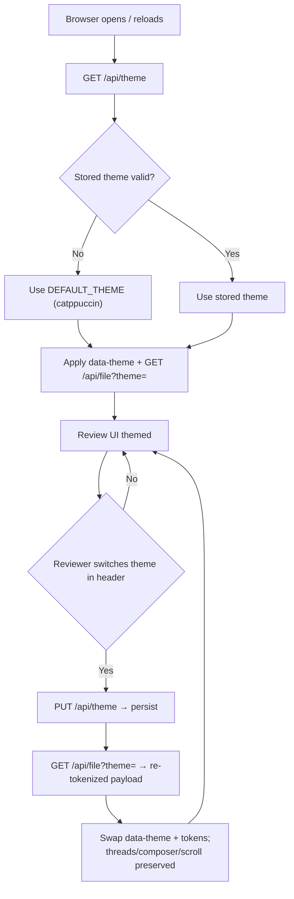

# Implementation Spec — v0.1 Themes

| | |
|---|---|
| Spec | `v-0.1-themes` (frozen once implemented) |
| Date | 2026-10-01 |
| Status | Implemented — v0.1 frozen |
| Provenance | Theme support deferred by `v-0.0-base.md` §5 ("Light/dark theme switching … future `v-0.x` items"); this spec is the normative delta |

---

## 1. User Story & Expected Behavior

**As a human reviewer**, when I open the review UI, it renders in the **catppuccin** theme by default. A theme selector in the header lets me switch between **Light**, **Dark**, and **Catppuccin** at any time; the whole UI — chrome and syntax-highlighted code colors — restyles instantly, my open comment threads, composer, scroll position, and windowing state are untouched, and my choice is remembered the next time I launch cryteeq.

**As a developer**, adding a new theme requires only: one registry entry (`src/shared/themes.ts`), one shiki mapping (compile-enforced), and one CSS variable block (`src/client/index.css`). Nothing else changes.



The contracts in §2–§5 are **normative** and amend the frozen `v-0.0-base.md` contracts; nothing in this spec modifies the CLI contract, exit codes, stdout purity, or report format. `SKILL.md` is unchanged.

## 2. Functional Requirements

### 2.1 Theming (FR-6)

| ID | Requirement |
|----|-------------|
| FR-6.1 | Three built-in themes ship out of the box: `light`, `dark`, `catppuccin` (Catppuccin Mocha). The default theme is `catppuccin` |
| FR-6.2 | A theme selector in the header switches the active theme immediately; the selection is persisted in the SQLite database and applies across relaunches and browsers on the same machine |
| FR-6.3 | Both UI chrome and syntax-highlighting token colors follow the theme. Tokens are re-generated server-side per theme (shiki `github-light` / `github-dark` / `catppuccin-mocha`); the `Token`/`FilePayload` wire shapes are unchanged |
| FR-6.4 | Switching themes preserves review state: expanded threads, open composer text, scroll position, and windowed-rendering position (FR-3.8) are untouched |
| FR-6.5 | Adding a theme is registry-driven and compile-safe: the theme id is declared once in the shared registry; the shiki mapping (`Record<ThemeId, BundledTheme>`) and the CSS palette block are the only other touch points — a missing mapping is a type error |
| FR-6.6 | An unknown theme id in the API (`?theme=` query or `PUT` body) is a `400` per the §4.3 error contract; an invalid value stored in the DB (manual edit, removed theme) is treated as the default at read time |

### 2.2 Persistence (amends FR-4)

| ID | Requirement |
|----|-------------|
| FR-4.6 | A `settings` key-value table (§4.4) stores global app preferences; the theme lives under key `theme`. Settings are read/written through the DB layer and commit immediately. The table DDL is idempotent like all other DDL |

## 3. Non-Functional Requirements

| ID | Requirement |
|---|---|
| NFR-6 | Theme switching is local-only: shiki themes lazy-load on first use, so cold start (NFR-1) is unaffected — the default theme loads exactly one shiki theme at first tokenize, as in v0.0 |
| NFR-7 | The theme registry is the single source of truth for theme ids and labels; the UI renders the selector from it, and a unit test locks registry ↔ shiki-map ↔ CSS sync |

## 4. Interface & Data Contracts

### 4.1 CLI

Unchanged (`v-0.0-base.md` §4.1). No new flags; `SKILL.md` is not modified.

### 4.2 Shared TypeScript types

New module `src/shared/themes.ts` (canonical registry):

```ts
export const THEME_IDS = ['light', 'dark', 'catppuccin'] as const;
export type ThemeId = (typeof THEME_IDS)[number];

export interface ThemeInfo { id: ThemeId; label: string }

export const THEMES: ThemeInfo[] = [
  { id: 'light', label: 'Light' },
  { id: 'dark', label: 'Dark' },
  { id: 'catppuccin', label: 'Catppuccin' },
];

export const DEFAULT_THEME: ThemeId = 'catppuccin';

export function isThemeId(value: unknown): value is ThemeId;
```

Addition to `src/shared/types.ts`:

```ts
export interface ThemeState {
  theme: ThemeId;      // current persisted theme (validated; invalid stored value -> DEFAULT_THEME)
  available: ThemeInfo[];
}
```

`Token`/`FilePayload` are unchanged (`v-0.0-base.md` §4.2); the `lines` colors vary by requested theme.

### 4.3 HTTP API (additions; error contract per v-0.0-base §4.3)

| Method & Path | Request | Success | Errors |
|---|---|---|---|
| `GET /api/theme` | — | `ThemeState` (stored value validated with `isThemeId`; missing/invalid → `DEFAULT_THEME`) | — |
| `PUT /api/theme` | `{"theme": string}` | `ThemeState` (persists via `setSetting`, commits immediately) | `400 {"error": "unknown theme"}` when `theme` is not a registry id |
| `GET /api/file?theme=<id>` | optional query | `FilePayload` tokenized with the requested theme. Absent `theme` → the stored setting (fallback `DEFAULT_THEME`) | `400 {"error": "unknown theme"}` for an unknown id |

### 4.4 Database schema (addition to the idempotent DDL)

```sql
CREATE TABLE IF NOT EXISTS settings (
  key   TEXT PRIMARY KEY,
  value TEXT NOT NULL
);
```

New helpers in `src/server/db.ts`: `getSetting(db, key): string | null` and `setSetting(db, key, value): void` (upsert via `INSERT … ON CONFLICT(key) DO UPDATE`; commits immediately — better-sqlite3 is synchronous).

### 4.5 CSS theming contract (`src/client/index.css`)

Tailwind 4 CSS-first theming: `@theme inline` maps semantic utilities to `--ct-*` variables; one palette block per theme; bare `:root` carries the catppuccin defaults so first paint (before the theme fetch resolves) matches the default theme.

Semantic tokens (all accept Tailwind opacity modifiers via `color-mix`):

| Token | Role |
|---|---|
| `app` | page background |
| `surface` | panels: file viewer, dialogs, report pre, header |
| `raised` | inputs, comment cards, hover/subtle row fills |
| `line` | panel borders |
| `line-strong` | input/button borders |
| `fg` / `muted` / `faint` | primary / secondary / tertiary text |
| `accent` / `accent-hover` / `accent-fg` / `accent-soft` | primary action bg / hover / text-on-accent / link-and-marker text |
| `danger` / `danger-hover` / `danger-fg` | destructive bg / hover / text-on-danger (also destructive text) |
| `warning` | hash-changed banner hue |

The dialog overlay dim (`bg-black/60`) is theme-independent. `AGENTS.md`'s "index.css contains only the Tailwind import" convention is amended by this spec: index.css now contains the Tailwind import, the `@theme inline` block, and the per-theme variable blocks — nothing else.

Initial palettes (first-pass values; visual contrast is refined via user QA only):

| Token | catppuccin (default) | dark (v0.0 look) | light |
|---|---|---|---|
| app | `#11111b` | `#0a0a0a` | `#ffffff` |
| surface | `#1e1e2e` | `#171717` | `#f6f8fa` |
| raised | `#313244` | `#262626` | `#eef2f6` |
| line | `#45475a` | `#262626` | `#d1d9e0` |
| line-strong | `#585b70` | `#404040` | `#b6bcc2` |
| fg | `#cdd6f4` | `#e5e5e5` | `#1f2328` |
| muted | `#a6adc8` | `#a3a3a3` | `#59636e` |
| faint | `#6c7086` | `#737373` | `#8c959f` |
| accent | `#89b4fa` | `#2563eb` | `#0969da` |
| accent-hover | `#b4befe` | `#3b82f6` | `#218bff` |
| accent-fg | `#11111b` | `#ffffff` | `#ffffff` |
| accent-soft | `#89b4fa` | `#93c5fd` | `#0550ae` |
| danger | `#f38ba8` | `#f87171` | `#cf222e` |
| danger-hover | `#eba0ac` | `#fca5a5` | `#a40e26` |
| danger-fg | `#11111b` | `#0a0a0a` | `#ffffff` |
| warning | `#f9e2af` | `#fcd34d` | `#9a6700` |

Theme activation: `App.tsx` sets `document.documentElement.dataset.theme = <current theme id>` in an effect.

### 4.6 Client state & API wrapper (amends v-0.0-base §4.6)

- `src/client/api.ts` additions: `getTheme(): Promise<ThemeState>`; `setTheme(theme: ThemeId): Promise<ThemeState>` (PUT); `getFile(theme: ThemeId): Promise<FilePayload>` (`?theme=` query).
- `useReview` remains the single state hook and now owns `theme`, `themes`, `switching`. `reload()` fetches `[getTheme, getReview, getComments]` in parallel, then `getFile(themeState.theme)`. `setTheme(id)` guards re-entrancy via `switching` (the selector is disabled while in flight — prevents out-of-order responses), then persists, updates theme state, and refetches the file payload.
- A failed switch rejects; `App.tsx` surfaces it through the existing `actionError` banner pattern.
- **FileViewer state preservation (normative):** the reset effect keys on `[file.content, needsWindowing]` — not `[file, needsWindowing]` — so a same-snapshot token refetch never collapses threads, closes the composer, or resets windowing; a restart (new snapshot content) still resets. Scroll position survives naturally (no unmount).

## 5. Out of Scope (do not build)

- User-loadable theme files (`~/.cryteeq/themes/`)
- `--theme` CLI flag; `prefers-color-scheme` OS detection
- Per-session or per-file themes (the setting is global, machine-wide)
- Report theming (the Markdown report is plain text; theme-independent)
- localStorage (SQLite is the only persistent store)

## 6. Acceptance Criteria

| # | Criterion | Covers | Verified by |
|---|---|---|---|
| 1 | Fresh install (no stored setting) → UI renders in catppuccin, selector shows Catppuccin | FR-6.1 | user QA |
| 2 | Switch to Light → chrome and code tokens restyle immediately; open threads, composer text, scroll position, and windowing are preserved | FR-6.3, FR-6.4 | user QA |
| 3 | Switch to Dark, kill the CLI, re-run on the same file → Dark theme (and across browsers) | FR-6.2 | user QA |
| 4 | Switching among all three themes keeps comment add/edit/delete working | FR-6.3 | user QA |
| 5 | `GET /api/theme` defaults to catppuccin when unset; `PUT` invalid id → `400 {"error": …}`; `GET /api/file?theme=unknown` → `400` | FR-6.6, §4.3 | inject test (TH3) |
| 6 | Stored invalid theme id treated as default at read time | FR-6.6 | unit test (TH3) |
| 7 | Registry ↔ shiki map ↔ CSS sync holds (exhaustive mapping; palette block per theme id) | FR-6.5, NFR-7 | unit test (TH1) |
| 8 | CLI contract untouched: `SKILL.md` unchanged, stdout purity unaffected | §4.1 | review (TH7) |

## 7. Task Breakdown

Tasks commit individually (`AGENTS.md` git rules); the verification gate runs before each commit.

### TH1 — Theme registry & shared types

- **Files:** `src/shared/themes.ts` [add], `src/shared/types.ts` (ThemeState), `tests/themes.test.ts` [add]
- **Contract:** §4.2 registry verbatim; tests: unique ids, `DEFAULT_THEME ∈ THEME_IDS`, non-empty labels, `SHIKI_THEMES` keys ≡ `THEME_IDS`, `index.css` has a `[data-theme]` block per non-default id and all `--ct-*` variables in `:root`
- **Deps:** none

### TH2 — DB settings

- **Files:** `src/server/db.ts`, `tests/db.test.ts`
- **Contract:** §4.4 settings DDL (idempotent) + `getSetting`/`setSetting`; tests: round-trip, upsert overwrite, idempotent reopen
- **Deps:** TH1

### TH3 — Server: themed tokenization & theme API

- **Files:** `src/server/highlight.ts`, `src/server/server.ts`, `tests/highlight.test.ts`, `tests/api.test.ts`
- **Contract:** `SHIKI_THEMES: Record<ThemeId, BundledTheme>` (exported for TH1's sync test); lazy theme loading; `tokenize(content, language, theme)`; routes per §4.3 with `400` validation; tests: per-theme line parity, distinct token colors across themes, plaintext fallback per theme, catppuccin bundling, route behavior matrix
- **Deps:** TH1, TH2

### TH4 — CSS theming foundation

- **Files:** `src/client/index.css`
- **Contract:** §4.5 `@theme inline` + palette blocks
- **Deps:** TH1 (ids fixed)

### TH5 — Semantic class migration

- **Files:** `App.tsx`, `components/Header.tsx`, `WarningBanner.tsx`, `Dialog.tsx`, `ConfirmDialog.tsx`, `ReportDialog.tsx`, `LineRow.tsx`, `CommentThread.tsx`, `FileViewer.tsx`
- **Contract:** every hard-coded neutral/blue/red/amber utility maps to a §4.5 semantic utility; `bg-black/60` overlay stays; no behavior change
- **Deps:** TH4

### TH6 — Theme switching end-to-end

- **Files:** `src/client/api.ts`, `useReview.ts`, `App.tsx`, `components/Header.tsx`, `components/FileViewer.tsx`
- **Contract:** §4.6 — wrappers, hook state (`theme`/`themes`/`switching`/`setTheme`), `data-theme` effect, switch-error banner, header `<select>` (native, `aria-label="Theme"`, disabled while switching), FileViewer deps fix
- **Deps:** TH3, TH5

### TH7 — Docs, version, final verification

- **Files:** `AGENTS.md` (index.css convention, folder structure), `README.md`, `package.json` (version `0.1.0`), `specs/v-0.1-themes.md` (status → frozen)
- **Contract:** `SKILL.md` verified unchanged; full verification gate green
- **Deps:** TH1–TH6

### Dependency graph

```
TH1 ─┬─ TH2 ─┐
     ├─ TH3 ─┤
     └─ TH4 ─ TH5 ─┴─ TH6 ─ TH7
```

- Parallelizable after TH1: {TH2, TH4}