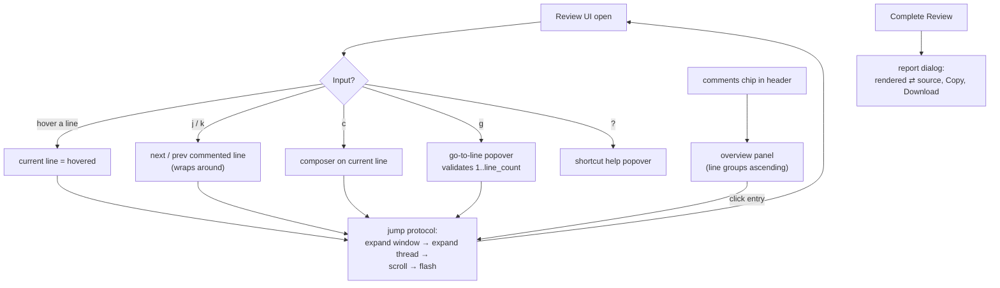

# Implementation Spec — v0.2 UX Overhaul

| | |
|---|---|
| Spec | `v-0.2-ux-overhaul` (frozen once implemented) |
| Date | 2026-10-01 |
| Status | Approved — pending implementation |
| Provenance | UX gaps in the v0.1 UI: no comment navigation, no keyboard shortcuts, minimal feedback states, an unrendered report dialog, and a composer that stays open after adding a comment. This spec is the normative delta. |

---

## 1. User Story & Expected Behavior

**As a human reviewer**, when I open the review UI I can orient myself instantly: the header's comment count is a chip that opens a **comment overview panel** listing every commented line — clicking an entry jumps me there, expanding its thread. I can move through the review with the keyboard alone: `j`/`k` step to the next/previous comment, `c` starts a comment on the line I'm on, `g` jumps to any line number, and `?` reminds me of the keys. The composer closes as soon as my comment is saved. When I complete the review, the report dialog shows the report **rendered as formatted Markdown** (with a source toggle), plus **Copy** and **Download** actions.

**As a reviewer in a hurry**, destructive actions are out of the way: **Start Fresh** lives behind an overflow menu instead of sitting next to **Complete Review**; loading, error, and empty states guide me instead of showing bare text.



The contracts in §2–§5 are **normative** and amend the frozen `v-0.0-base.md` FR-3 contracts. Nothing in this spec modifies the CLI contract, exit codes, stdout purity, report format, API wire shapes, or the database. `SKILL.md` is unchanged.

## 2. Functional Requirements

### 2.1 Review UX (FR-7)

| ID | Requirement |
|----|-------------|
| FR-7.1 | **Comment overview panel** (amends FR-3.6): the header comment count is a button that opens a slide-over panel on the right. The panel lists commented anchor lines in ascending order; each entry shows a line badge, the excerpt of the entry's first comment, and the comment count for that line. The panel header shows `N comments on M lines` (N = comments, M = distinct anchor lines). Clicking an entry triggers the jump protocol (FR-7.5) on that line. The panel closes via `Esc`, its × button, or the chip; its open state is client-only and never persisted |
| FR-7.2 | **Keyboard shortcuts** (new; complements FR-3.2): active only when the event target is not an editable element (input/textarea/select/contentEditable) and no `Meta`/`Ctrl`/`Alt` modifier is held. `j` → jump to the next commented anchor strictly after the current line, wrapping to the first; `k` → previous, wrapping to the last; with no current line, `j` goes to the first and `k` to the last commented anchor. `c` → open the composer on the current line (no-op without one). `g` → go-to-line popover. `?` → shortcut help popover. `Esc` closes the topmost of: help popover, go-to-line popover, overview panel (the composer keeps its own inline `Esc`, unchanged). The full key list is rendered in the help popover and defined once in `src/client/shortcuts.ts` |
| FR-7.3 | **Go-to-line**: `g` opens a small dialog with a number input; submitting a value in `1..line_count` applies the jump protocol in scroll-only mode (FR-7.5) to that line; invalid input shows an inline error and keeps the dialog open. `Enter` submits, `Esc` closes |
| FR-7.4 | **Composer closes on save** (amends FR-3.2/FR-3.5): after a comment is successfully persisted, the composer closes immediately and the thread remains expanded showing the new comment. A failed save leaves the composer open with its text intact |
| FR-7.5 | **Jump protocol** (new): jumping to line L (a) grows the render window to cover L before scrolling, (b) optionally expands L's thread, (c) scrolls L into view centered, (d) flashes L's row with a transient accent tint (~800 ms), and (e) sets L as the current line. Modes: overview/`j`/`k` expand the thread; `g` does not; `c` opens the composer instead of expanding |
| FR-7.6 | **Current line**: the last line hovered with the pointer or targeted by a jump is subtly highlighted (gentle background tint); it is the target of `c`. The highlight is presentational only and never persisted |
| FR-7.7 | **Report dialog upgrade** (amends FR-3.7): the completion dialog renders the report as formatted Markdown (via `react-markdown`, default), with a Rendered ⇄ Source toggle. **Copy** and **Download** always carry the raw Markdown source; Download saves `<file_name>.review.md` (e.g. `notes.md.review.md`) via a Blob. The "server has stopped" note is retained |
| FR-7.8 | **Header refinement** (amends FR-3.6): the header shows file name and path on the left and, right-aligned: the comments chip (FR-7.1), the wrap toggle, the theme selector, an overflow menu (⋯), and **Complete Review** (primary). **Start Fresh** moves into the overflow menu; its confirm dialog text and behavior are unchanged |
| FR-7.9 | **Feedback states**: loading renders a skeleton (shimmering placeholder rows); a load failure renders a styled error card with a **Retry** button; when the review has zero comments, a hint bar above the viewer suggests the first action ("Hover a line and press + — or c — to comment"). The `hash_changed` warning banner is unchanged |

### 2.2 Visual polish (non-binding guidance)

Relative timestamps on comment cards ("2m ago"; full ISO on hover), a ⌘/Ctrl+Enter submit hint under composers, consistent `focus-visible` rings, and color `transition`s on rows and controls. Exact look is refined via user QA only; the semantic-token system and `index.css` contents are unchanged (v-0.1-themes §4.5 still holds).

## 3. Non-Functional Requirements

| ID | Requirement |
|---|---|
| NFR-8 | No new `console.*` calls; the only new dependency is `react-markdown`. All new state lives in `App.tsx`/`useReview.ts`-owned hooks or component-local state; components stay presentational (§4.6). Theme switching preserves all new UI state — open threads, composer, scroll, windowing (FR-6.4) plus overview/current-line state — because the FileViewer reset effect continues to key on `[file.content, needsWindowing]`. All new controls are keyboard-reachable with `aria-label`s |

## 4. Interface & Data Contracts

### 4.1 CLI — unchanged

No new flags; `SKILL.md` is not modified by this spec.

### 4.2 New client modules (DOM-free, shared by both tsconfigs)

```ts
// src/client/format.ts
export function relativeTime(iso: string, now?: Date): string;
// "just now" (< 10 s) · "Ns ago" (< 60 s) · "Nm ago" (< 60 m) · "Nh ago" (< 24 h)
// · "Nd ago" (< 7 d) · else "MMM D" (same year) / "MMM D, YYYY" (en-US month names);
// future timestamps clamp to "just now"

export function excerpt(text: string, max?: number): string;
// first line, trimmed, whitespace-collapsed; longer than max → truncated with "…"

// src/client/shortcuts.ts
export interface EditableLike { tagName?: string; isContentEditable?: boolean }
export function isEditableTarget(target: EditableLike | null | undefined): boolean;
// true when tagName (case-insensitive) is INPUT/TEXTAREA/SELECT or isContentEditable

export const SHORTCUTS: ReadonlyArray<{ keys: string; description: string }>;
// single source of truth rendered by the help popover
```

Both modules avoid DOM types so `tests/` (compiled without DOM libs, `tsconfig.json`) can import them.

### 4.3 Component & state contracts

- **New components:** `CommentOverview.tsx` (slide-over panel), `GoToLine.tsx` (popover dialog), `ShortcutHelp.tsx` (popover dialog), `Loading.tsx` (skeleton). All presentational.
- **Jump protocol wiring:** `App.tsx` owns `jump: { line: number; expand: boolean; compose: boolean; nonce: number } | null` and `currentLine: number | null`. `FileViewer` consumes a change of `nonce` by: growing `visible` to cover the line, expanding the thread (or opening the composer when `compose`), scrolling the row (centered) into view, and flashing the row. `LineRow` gains `data-line`, a `flash` prop, an `isCurrent` prop, and an `onHoverLine` callback; the row carries the flash tint for ~800 ms.
- **Header:** overflow menu is local state in `Header.tsx` (click-outside closes); **Start Fresh** item renders in danger text; all existing callbacks are unchanged.
- **ReportDialog:** `mode: "rendered" | "source"` local state; rendered view styles via `react-markdown` component overrides using semantic utilities only (no `@tailwindcss/typography`); raw HTML is not rendered (react-markdown default). Download uses `Blob` + object URL, filename `<file_name>.review.md`.
- **States:** `useReview` exposes `retry` (re-runs the initial load, clearing `error`); loading/error/empty-hint render in `App.tsx` before the viewer.

### 4.4 Dependencies

`react-markdown` (client-side only; adds no server-bundle weight). No other new packages.

### 4.5 CSS contract — unchanged

`src/client/index.css` keeps exactly the v-0.1 contents (Tailwind import, `@theme inline`, per-theme palettes). All new styling uses existing semantic utilities and Tailwind's built-in `animate-pulse`/`transition-*`.

## 5. Out of Scope (do not build)

- In-file text search; URL hash deep-linking
- Toasts, undo-on-delete, optimistic UI
- Comment replies/threading, resolve workflow
- Auto-context quotes around anchors (range quotes are `v-0.3`, reviewer-selected)
- Any server, API, DB, report-format, CLI, or `SKILL.md` change

## 6. Acceptance Criteria

| # | Criterion | Covers | Verified by |
|---|---|---|---|
| 1 | Comments chip opens the overview; entries ascending by line; header shows "N comments on M lines" | FR-7.1 | user QA |
| 2 | Clicking an overview entry scrolls to the line, expands its thread, and flashes it; window grows for out-of-window lines | FR-7.5, FR-3.8 | user QA |
| 3 | `j`/`k` navigate commented lines with wrap-around; `c` opens the composer on the current line; `g` jumps to a valid line and rejects invalid ones inline; `?` shows help; all keys are inert while typing in inputs/textareas and with modifiers held | FR-7.2, FR-7.3 | user QA |
| 4 | Submitting a comment closes the composer; the thread stays expanded with the new comment; theme switching preserves jump/current/overview state | FR-7.4, FR-6.4 | user QA |
| 5 | The composer-closes-on-add and card polish (relative timestamps with ISO tooltips, ⌘/Ctrl+Enter hint) render per §2.2 | FR-7.4 | user QA |
| 6 | **Start Fresh** appears only in the overflow menu; its confirm dialog is unchanged; **Complete Review** stays primary | FR-7.8 | user QA |
| 7 | Report dialog: rendered Markdown by default, source toggle, Copy, Download `<file_name>.review.md`; copy/download output is the raw source | FR-7.7 | user QA |
| 8 | Loading skeleton, error card with working Retry, zero-comment hint bar | FR-7.9 | user QA |
| 9 | Helper units: `relativeTime` buckets, `excerpt` truncation, `isEditableTarget` matrix | §4.2 | unit test (UX1) |
| 10 | `SKILL.md` unchanged; verification gate green | §4.1 | review + gate (UX7) |

## 7. Task Breakdown

Tasks commit individually (`AGENTS.md` git rules); the verification gate runs before each commit.

### UX0 — Author this spec

- **Files:** `specs/v-0.2-ux-overhaul.md` [add]
- **Deps:** none

### UX1 — Client helpers + tests

- **Files:** `src/client/format.ts` [add], `src/client/shortcuts.ts` [add], `tests/client-helpers.test.ts` [add]
- **Contract:** §4.2 verbatim; DOM-free; tests: `relativeTime` boundary buckets with fixed `now`, future clamp, year rollover; `excerpt` collapse/truncation; `isEditableTarget` cases; `SHORTCUTS` non-empty with unique `keys`
- **Deps:** UX0

### UX2 — Comment overview panel

- **Files:** `src/client/components/CommentOverview.tsx` [add], `App.tsx`, `components/Header.tsx`, `components/FileViewer.tsx`, `components/LineRow.tsx`
- **Contract:** FR-7.1 chip + panel; jump protocol plumbing (§4.3): `data-line`, flash, window growth, scroll-into-view, thread expansion
- **Deps:** UX1

### UX3 — Keyboard shortcuts, go-to-line, help

- **Files:** `App.tsx`, `components/GoToLine.tsx` [add], `components/ShortcutHelp.tsx` [add], `components/FileViewer.tsx`, `components/LineRow.tsx`
- **Contract:** FR-7.2/FR-7.3/FR-7.5/FR-7.6 — window-level keydown with editable/modifier guards, wrap-around next/prev, jump modes (expand / scroll-only / compose), current-line highlight via hover callback
- **Deps:** UX2

### UX4 — Composer close-on-add + card polish

- **Files:** `components/FileViewer.tsx`, `components/CommentThread.tsx`, `components/LineRow.tsx`
- **Contract:** FR-7.4 — FileViewer wraps `onAdd` to close the composer only after the awaited save resolves; failed saves keep the composer open; §2.2 polish (relative timestamps + tooltips, ⌘/Ctrl+Enter hints, focus rings, transitions)
- **Deps:** UX3

### UX5 — Header redesign + feedback states

- **Files:** `components/Header.tsx`, `components/Loading.tsx` [add], `App.tsx`, `useReview.ts`
- **Contract:** FR-7.8 overflow menu with Start Fresh; FR-7.9 skeleton/error-card-with-Retry (`useReview.retry`)/empty hint bar; wire/format/theme/complete callbacks unchanged
- **Deps:** UX2 (chip)

### UX6 — Report dialog upgrade

- **Files:** `package.json` (+lock), `components/ReportDialog.tsx`
- **Contract:** FR-7.7 — add `react-markdown`; rendered/source toggle; semantic-utility component overrides; Download `<file_name>.review.md`; Copy unchanged
- **Deps:** UX0

### UX7 — Docs, version, final verification

- **Files:** `AGENTS.md` (folder structure), `README.md`, `package.json` (`0.2.0`), `specs/v-0.2-ux-overhaul.md` (status → frozen)
- **Contract:** `SKILL.md` verified unchanged; full verification gate green
- **Deps:** UX1–UX6

### Dependency graph

```
UX0 ─┬─ UX1 ─ UX2 ─┬─ UX3 ─ UX4 ─┐
     │             └─ UX5 ──────┤
     └─ UX6 ────────────────────┴─ UX7
```
