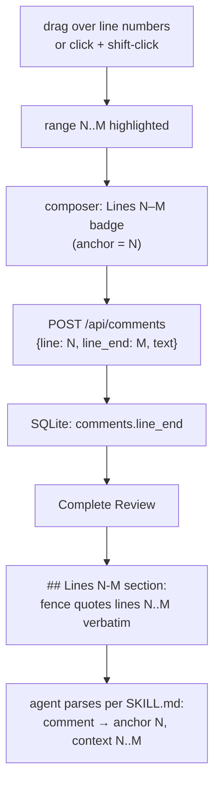

# Implementation Spec — v0.3 Range Quotes

| | |
|---|---|
| Spec | `v-0.3-range-quotes` (frozen once implemented) |
| Date | 2026-10-01 |
| Status | Approved — pending implementation |
| Provenance | Reviewer request: "a comment is tied to a single line, but the quoted text should allow line ranges." This spec amends the normative report format (`v-0.0-base.md` §4.5), the API (FR-2.5), and the DB schema. `SKILL.md` is updated in the same change |

---

## 1. User Story & Expected Behavior

**As a human reviewer**, I can select a contiguous range of lines — by pressing and dragging across line numbers, or by clicking one line number and shift-clicking another — and comment on it. The comment is **anchored to the first selected line**; the composer shows a "Lines N–M" badge; the selected rows highlight while I select.

**As a consuming AI agent**, the report makes the range explicit: a range comment produces a `## Lines N-M` section whose fenced block quotes lines N..M verbatim; N is the anchor I map the feedback to. Single-line comments are unchanged (`## Line N`), and a report containing only single-line comments is **byte-identical** to the v0.0–v0.2 format.



The contracts in §2–§6 are **normative**. This spec amends `v-0.0-base.md` §4.5 (report format) and FR-2.5 (API); the CLI contract, exit codes, and stdout purity are unchanged. `SKILL.md` must be updated in the same change (§4.6).

## 2. Functional Requirements

### 2.1 Range quotes (FR-8)

| ID | Requirement |
|----|-------------|
| FR-8.1 | A comment may quote a contiguous line range `N..M` (inclusive). The **anchor** is `N`, the first selected line. `line_end` is `null` (or equal to `line`) ⇔ single-line comment; all v0.2 behavior for single-line comments is unchanged |
| FR-8.2 | API (amends FR-2.5): `POST /api/comments` accepts an optional `line_end`. Validation: absent or `null` → single-line; present and a non-null integer with `line <= line_end <= line_count` → accepted; anything else → `400 {"error": "line_end must be an integer between {line} and {line_count}"}` per the §4.3 error contract. `GET /api/comments` returns `line_end` on every comment. `PATCH /api/comments/:id` stays text-only — an existing comment's range is never editable. `line` validation is unchanged |
| FR-8.3 | DB: `comments.line_end INTEGER` nullable (`NULL` ⇔ single-line). The fresh DDL includes the column; existing databases gain it via a guarded `ALTER TABLE` (idempotent open preserved, `v-0.0-base.md` §4.4). `Start Fresh` and completion flows pass `line_end` through |
| FR-8.4 | Report format amendment — **normative §4.5 amendment**, see §4.5 below: sections keyed by `(start, end)`; heading `## Line {n}` when `start === end`, `## Lines {n}-{m}` when `end > start`; the fence quotes lines `start..end` verbatim; sections ordered ascending by `(start, end)`; overlapping ranges are permitted |
| FR-8.5 | UI range selection: press-and-drag across line numbers (live highlight of the rows being covered), or click one line-number cell (sets a visible anchor) then shift-click another (range = min..max), opens the composer with a "Lines N–M" context badge. The `+` gutter button and the `c` shortcut keep producing single-line comments. Range comments render in the anchor line's thread and show a "Lines N–M" badge there and in the overview panel. Selection operates on rendered lines; the render window grows on scroll as before (FR-3.8) |
| FR-8.6 | `SKILL.md` parsing rules and README report documentation are updated in the same change (§4.6): agents map each comment to anchor `N` with quoted context `N..M`, and must not assume sections are non-overlapping |

## 3. Non-Functional Requirements

| ID | Requirement |
|---|---|
| NFR-9 | A report containing only single-line comments is byte-identical to the v0.0–v0.2 format — pinned by a golden regression test on the base §4.5 sample. Existing databases migrate losslessly (`line_end` added as `NULL`). The adaptive-fence rule is computed over the entire quoted block |

## 4. Interface & Data Contracts

### 4.1 CLI — unchanged

No new flags. Exit codes, stdout purity, and stderr behavior are untouched. `SKILL.md` **is** modified (report format + parsing rules, §4.6).

### 4.2 Shared TypeScript types

```ts
// src/shared/types.ts — Comment gains:
export interface Comment {
  id: number;
  line: number;          // 1-based anchor
  line_end: number | null; // inclusive quote end; null ⇔ single-line
  text: string;
  created_at: string;
  updated_at: string;
}

// src/server/report.ts — generator input (structural, optional for back-compat):
export interface ReportComment {
  id: number;
  line: number;
  line_end?: number | null;
  text: string;
}
```

`line_end` is optional in `ReportComment` so existing generator call sites and tests compile unchanged — the single-line regression signal stays intact.

### 4.3 HTTP API (amends FR-2.5; error contract per v-0.0-base.md §4.3)

| Method & Path | Request | Success | Errors |
|---|---|---|---|
| `POST /api/comments` | `{line, text, line_end?}` | created `Comment` (includes `line_end`) | `400` line/text validation unchanged · `400 {"error": "line_end must be an integer between {line} and {line_count}"}` |
| `GET /api/comments` | — | `Comment[]`, each with `line_end` | — |
| `PATCH /api/comments/:id` | `{text}` | unchanged | unchanged |

### 4.4 Database schema (amendment to the idempotent DDL)

```sql
-- fresh DDL gains the column:
CREATE TABLE IF NOT EXISTS comments (
  id          INTEGER PRIMARY KEY,
  review_id   INTEGER NOT NULL REFERENCES reviews(id) ON DELETE CASCADE,
  line_number INTEGER NOT NULL,
  line_end    INTEGER,
  text        TEXT NOT NULL,
  created_at   TEXT NOT NULL,
  updated_at   TEXT NOT NULL
);

-- pre-v0.3 databases, guarded (idempotent): after the CREATE TABLE block,
-- check PRAGMA table_info(comments) for 'line_end'; if missing:
ALTER TABLE comments ADD COLUMN line_end INTEGER;
```

`CommentRow` gains `line_end: number | null`; `insertComment(db, reviewId, line, lineEnd, text)` commits immediately (NFR-4).

### 4.5 Report Format — normative amendment of `v-0.0-base.md` §4.5

**Unchanged:** title, metadata bullets (incl. `- **Comments:** {count}` — the number of **comments**, not sections), zero-comment reports (metadata only), one unbroken `> ` blockquote run per comment with blank-line separation, exactly one trailing newline.

**Amended section rules:**

1. Sections are keyed by `(start, end)` where `start` = anchor line and `end` = `line_end ?? start`.
2. Heading: `## Line {n}` when `start === end`; `## Lines {n}-{m}` when `end > start`.
3. The fenced block is tagged `text` and quotes lines `start..end` of the LF-normalized snapshot verbatim, joined with LF — blank quoted lines appear as empty lines inside the fence. Fence length: three backticks extended by one more than the longest backtick run **anywhere in the entire quoted block** (CommonMark adaptive rule).
4. Sections are ordered ascending by `(start, end)` — at the same start the narrower range comes first; overlapping ranges are permitted and resolved by this ordering.
5. Comments sharing an identical `(start, end)` key share one section: blockquote runs in ascending comment-id order separated by a blank line. Comments with different keys get separate sections even on the same anchor line.

**Normative sample** (4 comments: line 2 single · lines 40–42 ×2 · line 41 single — note `(40,42)` precedes `(41,41)`):

`````markdown
# Review: notes.md

- **File:** `/abs/path/notes.md`
- **Date:** 2026-09-30T18:22:41.000Z
- **SHA-256:** `9f2c1ab3d5e7f9a1b3c5d7e9f1a3b5c7d9e1f3a5b7c9d1e3f5a7b9c1d3e5f7a9`
- **Comments:** 4

## Line 2

```text
This is the reviewed line's content, quoted verbatim.
```

> Fix this sentence.

## Lines 40-42

```text
Another reviewed line.
A second line in the quoted range.

The third line, after a blank line, quoted verbatim.
```

> Rewrite this whole block.

> Also fix the indentation here.

## Line 41

```text
A second line in the quoted range.
```

> Only this line needs the import fix.
`````

**Rules carried forward:** no resolution state; the SHA-256 pins the snapshot the quotes come from; the generator output ends with exactly one trailing newline; generator input stays structural (§4.2).

### 4.6 `SKILL.md` — parsing rules (updated in this change)

- Section headings: `## Line N` (single-line quote) or `## Lines N-M` (N = anchor, M = inclusive end). Sections appear in ascending `(start, end)` order and **may overlap** — never assume non-overlap.
- Each comment = one unbroken `> ` blockquote run; consecutive runs under one heading (blank line between) are multiple comments on that exact quote, in id order.
- The fenced `text` block immediately after a heading quotes that range verbatim (one line for `## Line N`, lines N..M for `## Lines N-M`); take the whole fenced block regardless of delimiter length.
- Map each comment to anchor line **N**; the fenced block is its quoted context, spanning **N..M**.
- Zero comments → metadata only; unchanged. All other parsing rules (SHA-256 pinning, `>` stripping, blank-line handling) unchanged.

### 4.7 Client state & API wrapper (amends v-0.0-base.md §4.6)

- `api.addComment(line: number, lineEnd: number | null, text: string)` posts `{line, text, line_end: lineEnd}`; `useReview.addComment` mirrors the signature.
- `FileViewer` owns selection state: a drag start/end pair (live highlight while dragging, `user-select` suppressed on the viewer during drag), a click anchor line, and the composer target becomes `{start, end}`. Range gestures open the composer for `min..max`; the composer and thread render a "Lines N–M" badge when `end > start`.
- `c` and the `+` gutter button keep producing single-line composers; the jump protocol (FR-7.5) is unchanged.

## 5. Out of Scope (do not build)

- Editing an existing comment's range (PATCH stays text-only)
- Non-contiguous or nested quotes; auto-context quoting
- Forbidding or warning about overlapping ranges
- Range restrictions in `SKILL.md` invocation (the CLI has no flags for this)

## 6. Acceptance Criteria

| # | Criterion | Covers | Verified by |
|---|---|---|---|
| 1 | Drag lines 10→15 (or click 10, shift-click 15) opens a "Lines 10–15" composer; submit persists and the anchor thread shows the badge | FR-8.5 | user QA |
| 2 | The report renders `## Lines 10-15` with the fence quoting lines 10..15 verbatim (blank lines preserved) | FR-8.4 | unit test (RQ3) |
| 3 | Golden: a single-line-only report is byte-identical to the base §4.5 sample; existing report tests pass unmodified | NFR-9 | unit test (RQ3) |
| 4 | Ordering: same-anchor sections narrow-before-wide; overlapping sections ordered by `(start, end)` | FR-8.4 | unit test (RQ3) |
| 5 | Adaptive fence over a block containing ``` renders with 4+ backtick delimiters | FR-8.4 | unit test (RQ3) |
| 6 | API matrix: valid range · `null`/absent → single · `line_end < line` / `> line_count` / non-integer → `400`; GET returns `line_end` | FR-8.2 | inject test (RQ2) |
| 7 | Fresh DB has the column; a pre-v0.3 DB upgrades losslessly (rows preserved, `line_end` NULL); reopen is idempotent | FR-8.3 | unit test (RQ1) |
| 8 | `SKILL.md` + README report documentation updated in the same change as the generator | FR-8.6 | review (RQ3) |
| 9 | `- **Comments:**` counts comments, not sections | FR-8.4 | unit test (RQ3) |

## 7. Task Breakdown

Tasks commit individually (`AGENTS.md` git rules); the verification gate runs before each commit.

### RQ0 — Author this spec

- **Files:** `specs/v-0.3-range-quotes.md` [add]
- **Deps:** none

### RQ1 — DB: `line_end` + migration

- **Files:** `src/server/db.ts`, `tests/db.test.ts`
- **Contract:** §4.4 — fresh DDL, guarded `ALTER` via `PRAGMA table_info`; `CommentRow.line_end`; `insertComment(db, reviewId, line, lineEnd, text)`. Tests: fresh schema, simulated pre-v0.3 upgrade (rows preserved, `NULL` end), idempotent reopen, single/range round-trip
- **Deps:** RQ0

### RQ2 — Types, server validation, API wrapper

- **Files:** `src/shared/types.ts`, `src/server/server.ts`, `src/client/api.ts`, `tests/api.test.ts`
- **Contract:** §4.2/§4.3/§4.7 — `Comment.line_end`; POST validation + `400` matrix; GET passthrough; `complete` report input gains `line_end`; `api.addComment(line, lineEnd, text)`. Tests: inject matrix per acceptance #6
- **Deps:** RQ1

### RQ3 — Report generator + `SKILL.md` + README (one commit)

- **Files:** `src/server/report.ts`, `tests/report.test.ts`, `SKILL.md`, `README.md`
- **Contract:** §4.5/§4.6 — section keying, headings, block fence, ordering, shared sections; golden single-line regression; new range cases per acceptance #2–#5, #9; `SKILL.md`/README docs land in the same commit
- **Deps:** RQ1, RQ2

### RQ4 — Client range selection

- **Files:** `src/client/components/FileViewer.tsx`, `components/LineRow.tsx`, `components/CommentThread.tsx`, `components/CommentOverview.tsx`, `src/client/useReview.ts`
- **Contract:** FR-8.5/§4.7 — drag (pointer events, live highlight, `user-select` suppression) + click/shift-click anchor; composer `{start, end}` with badge; per-comment "Lines N–M" badges in threads and overview; `c`/`+` stay single-line
- **Deps:** RQ2

### RQ5 — Docs, version, final verification

- **Files:** `AGENTS.md`, `README.md` (feature + status), `package.json` (`0.3.0`), `specs/v-0.3-range-quotes.md` (status → frozen)
- **Contract:** `SKILL.md` verified current; full verification gate green
- **Deps:** RQ1–RQ4

### Dependency graph

```
RQ0 ─ RQ1 ─ RQ2 ─┬─ RQ3 ─┐
                 └─ RQ4 ─┴─ RQ5
```
