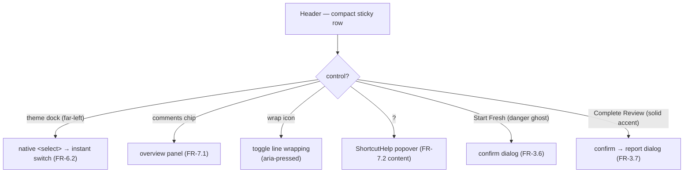

# Implementation Spec — v0.5 Header Redesign

| | |
|---|---|
| Spec | `v-0.5-header` (frozen once implemented) |
| Date | 2026-10-01 |
| Status | Approved (interactive mockup review) — ready for implementation |
| Provenance | The v0.2 header (FR-7.8) packs five individually bordered controls plus a two-line title into one row — the theme `<select>` is the widest control in it, and the single colored action competes with four outlined boxes. This spec restructures the header into a GitHub-style compact row: the theme selector docks far-left as an app-level preference, secondary controls go borderless-ghost, **Start Fresh** returns to plain sight, and the overflow menu is deleted. No server, API, DB, report-format, CLI, or `SKILL.md` contract changes. |

---

## 1. User Story & Expected Behavior

**As a human reviewer**, when I open the review UI the header orients me instantly. The file identity — mono file name with a faint `· N lines` count, full path beneath — is the visual anchor. Review actions sit quiet and borderless on the right with exactly one colored button: **Complete Review**. **Start Fresh** is honest and visible in danger text, still guarded by its confirm dialog. Keyboard help is discoverable at a glance via a `?` button. Theme switching stays one click, docked **far-left** behind a hairline divider — clearly an app-level preference, not a review action.



The contracts in §2–§5 are **normative** and amend the frozen `v-0.2-ux-overhaul.md` FR-7.8 (header layout) plus the *presentation* details of FR-6.2 (theme selector styling/position) and FR-7.1 (chip rendering). The behavioral cores of FR-6.2, FR-7.1, and FR-3.6 are unchanged. Nothing in this spec modifies the CLI contract, exit codes, stdout purity, report format, API wire shapes, or the database. `SKILL.md` is unchanged.

## 2. Functional Requirements

### 2.1 Header (FR-8) — amends FR-7.8

| ID | Requirement |
|----|-------------|
| FR-8.1 | **Layout** (amends FR-7.8): a single compact sticky row (sticky top, `backdrop-blur`, bottom hairline retained). Inner container `max-w-5xl`, centered. Far-left: the theme dock (FR-8.5) followed by a vertical hairline divider; then the identity block — file name in mono (`13px`, semibold) with a faint mono `· N lines` count on the first line, full path on a second faint mono line (11px, truncated, `title` tooltip). Right-aligned actions, in order: comments chip (FR-8.3), wrap toggle (FR-8.4), help button (FR-8.6), a hairline divider, **Start Fresh** (FR-8.7), and **Complete Review** (FR-8.8, right-most). On narrow viewports the row may wrap to a second line (`flex-wrap`); no control is hidden, removed, or reordered |
| FR-8.2 | **Ghost controls**: every secondary control is borderless — transparent background, muted icon color, 32×32px hit area for icon buttons (16px SVG icons), `bg-raised` + foreground icon on hover, consistent accent `focus-visible` rings, and native `title` tooltips on all non-text-bearing controls. Only **Complete Review** carries a solid accent fill; no other control is bordered or filled. Text-bearing ghost controls (chip, Start Fresh) use horizontal padding instead of a square hit area |
| FR-8.3 | **Comments chip** (presentation amends FR-7.1): comment icon + count, accent-tinted icon when at least one comment exists, neutral (faint) at zero; opens the overview panel exactly as before, toggling it closed when open. `aria-label` reads `N comments — open overview` (singularized). All FR-7.1 panel behavior, jump protocol, and Esc/× closing are unchanged |
| FR-8.4 | **Wrap toggle** (presentation amends FR-3.6): icon-only ghost button, `aria-pressed` bound to the wrap state, `aria-label`/`title` "Toggle line wrapping"; pressed state shows an accent-tinted icon on a soft accent background. Behavior (viewer wrapping) unchanged |
| FR-8.5 | **Theme dock** (presentation amends FR-6.2): the selector remains a **native `<select>`** in the header — `aria-label="Theme"`, disabled while switching, persisted in the DB `settings` table — rendered invisible (`opacity-0`, absolutely covering its presentational wrapper) behind a contrast icon + chevron-down icon docked **far-left**. The wrapper carries `title="Theme: <current label>"`, a hover background, and shows a keyboard focus ring when the select is focused. One-click switching, instant restyle, and state preservation (FR-6.4) are unchanged |
| FR-8.6 | **Help affordance** (new): a `?` ghost icon button with `aria-label`/`title` "Keyboard shortcuts" opens the existing ShortcutHelp popover — the same dialog the `?` key opens. Esc/× closing per FR-7.2 is unchanged; no new shortcut is added and `shortcuts.ts` is untouched |
| FR-8.7 | **Start Fresh visible** (amends FR-7.8): Start Fresh renders in the header as a danger-text ghost button, left of the divider before Complete Review; its confirm dialog text and behavior (FR-3.6) are unchanged. The overflow menu (⋯ button, menu state, click-outside handling) is **deleted** — the header no longer contains any popover besides the theme select popup and the help/confirm dialogs |
| FR-8.8 | **Complete Review** (amends FR-7.8): solid accent primary, right-most control; confirm dialog, zero-comment warning, report generation, and retry-on-failure behavior are unchanged |

### 2.2 Visual polish (non-binding guidance)

The identity block may shorten long file names with ellipsis; the `· N lines` count uses `tabular-nums`; ghost hover transitions stay in the 0.15s range. Exact look is refined via user QA only; the semantic-token system and `index.css` contents are unchanged.

## 3. Non-Functional Requirements

| ID | Requirement |
|---|---|
| NFR-9 | No new dependencies; all icons are hand-authored inline SVGs in one module. The header remains presentational — the only new prop is `onOpenHelp`; every existing callback keeps its signature. No new `console.*` calls. All icon-only controls carry `aria-label`s; all controls stay keyboard-reachable. Theme switching preserves all UI state (FR-6.4) because no effect keys change. Nothing outside `src/client/components/Header.tsx`, `src/client/components/icons.tsx`, and the single `onOpenHelp` wiring in `App.tsx` changes behavior |

## 4. Interface & Data Contracts

### 4.1 CLI — unchanged

No new flags; `SKILL.md` is not modified by this spec.

### 4.2 New client module — `src/client/components/icons.tsx`

```tsx
export function CommentsIcon(): JSX.Element;   // speech bubble
export function WrapIcon(): JSX.Element;       // wrapped-lines + arrow
export function ContrastIcon(): JSX.Element;   // half-filled circle (theme)
export function ChevronDownIcon(): JSX.Element;
export function HelpIcon(): JSX.Element;       // circled question mark
```

Each renders a 16×16 inline SVG: `fill="none"`, `stroke="currentColor"`, `stroke-width="1.5"`, `aria-hidden="true"`, no props or state. Components that need a non-16px render scale via `width`/`height` attributes on the SVG root.

### 4.3 Component & state contracts

- **`Header.tsx`** — props:

```tsx
interface HeaderProps {
  review: ReviewMeta;
  commentCount: number;
  wrap: boolean;
  theme: ThemeId;
  themes: ThemeInfo[];
  themeSwitching: boolean;
  onToggleWrap: () => void;
  onThemeChange: (theme: ThemeId) => void;
  onOpenOverview: () => void;
  onOpenHelp: () => void;      // new — opens the ShortcutHelp popover
  onComplete: () => void;
  onStartFresh: () => void;
}
```

  All existing callbacks are unchanged. The overflow menu, its local state, and its click-outside effect are removed; the component holds no local state.
- **`App.tsx`** — passes `onOpenHelp={() => setHelpOpen(true)}` to `Header`; the `helpOpen` state, Esc handling, and `ShortcutHelp` rendering are untouched.
- **Order normative:** theme dock, divider, identity, chip, wrap, help, divider, Start Fresh, Complete Review (FR-8.1).

### 4.4 Dependencies — none

### 4.5 CSS contract — unchanged

`src/client/index.css` keeps exactly the v-0.1 contents. All new styling uses existing semantic utilities plus Tailwind built-ins (`backdrop-blur`, `opacity-0`, `absolute inset-0`, `tabular-nums`, `transition-colors`, `focus-visible:`, `focus-within:`).

## 5. Out of Scope (do not build)

- A custom theme popover/menu (the native `<select>` stays), a custom tooltip system, or animation of the theme icon
- Collapsing, hiding, or reordering controls on narrow viewports beyond the wrap behavior in FR-8.1
- Changes to `shortcuts.ts`, `SHORTCUTS`, or the help popover content; new keyboard shortcuts
- Any server, API, DB, report-format, CLI, or `SKILL.md` change

## 6. Acceptance Criteria

| # | Criterion | Covers | Verified by |
|---|---|---|---|
| 1 | Header renders one compact row: theme dock far-left, hairline, mono identity with `· N lines`, right actions in FR-8.1 order; sticky + blur retained; wraps (not truncates actions) on narrow viewports | FR-8.1 | user QA |
| 2 | No secondary control has a border or fill; only Complete Review is colored; keyboard tabbing shows accent rings; every icon-only control has a visible `title` tooltip | FR-8.2 | user QA |
| 3 | Chip opens/toggles the overview; icon is accent-tinted with comments, neutral at zero; overview behavior unchanged | FR-8.3, FR-7.1 | user QA |
| 4 | Wrap toggle reflects `aria-pressed`; toggling changes viewer wrapping; pressed state is accent-tinted | FR-8.4 | user QA |
| 5 | Theme dock: one-click switch from far-left; select disabled while switching; choice persists across relaunch; focus ring shows on keyboard focus; title follows the current theme | FR-8.5, FR-6.2 | user QA + gate (api/themes tests) |
| 6 | `?` opens the existing shortcuts popover; `Esc` closes it; the `?` key still works | FR-8.6 | user QA |
| 7 | Start Fresh is visible in danger text; its confirm dialog text is unchanged; no overflow menu exists anywhere in the header | FR-8.7, FR-3.6 | user QA |
| 8 | Complete Review opens the unchanged confirm; zero-comment warning and report flow behave as before | FR-8.8, FR-3.6, FR-5.3 | user QA |
| 9 | Theme switching preserves open threads, composer, scroll, windowing, overview, and current-line state | NFR-9, FR-6.4 | user QA |
| 10 | `SKILL.md` unchanged; verification gate green | §4.1 | review + gate (HDR3) |

## 7. Task Breakdown

Tasks commit individually (`AGENTS.md` git rules); the verification gate runs before each commit.

### HDR0 — Author this spec

- **Files:** `specs/v-0.5-header.md` [add]
- **Deps:** none

### HDR1 — Icons module

- **Files:** `src/client/components/icons.tsx` [add]
- **Contract:** §4.2 verbatim — five components, 16×16 stroke SVGs, `aria-hidden`, no props
- **Deps:** HDR0

### HDR2 — Header redesign + App wiring

- **Files:** `src/client/components/Header.tsx`, `src/client/App.tsx`
- **Contract:** FR-8.1–FR-8.8; `HeaderProps.onOpenHelp` (§4.3); overflow menu and its state/effects deleted; `App.tsx` passes `onOpenHelp={() => setHelpOpen(true)}`; all other callbacks unchanged
- **Deps:** HDR1

### HDR3 — Docs, version, final verification

- **Files:** `README.md`, `AGENTS.md` (folder structure + specs tree), `package.json` (`0.5.0`), `specs/v-0.5-header.md` (status → frozen)
- **Contract:** `SKILL.md` verified unchanged; full verification gate green
- **Deps:** HDR1, HDR2

### Dependency graph

```
HDR0 ─ HDR1 ─ HDR2 ─ HDR3
```
